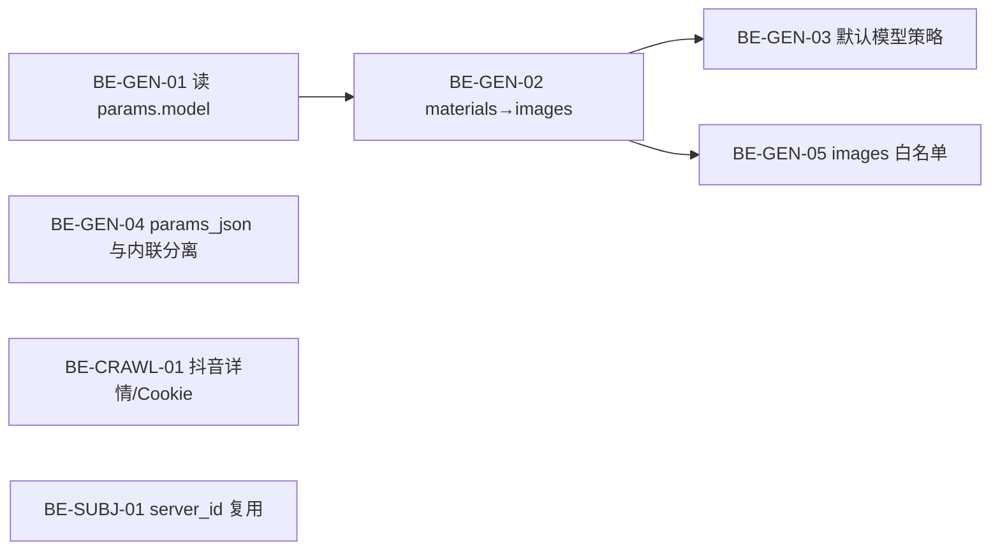

# 16 — 统一生成后端已知问题与修复清单

> **用途**：记录联调「素材库 / 工作台 / 口播向导 / 发布 / 文案提取」时暴露的**服务端缺陷**与**前后端剩余项**，供后端同学按优先级修复。  
> **关联文档**：[统一生成 API 文档](../API/统一生成API文档.md)、[15-客户端业务逻辑与服务端功能对照手册](./15-客户端业务逻辑与服务端功能对照手册.md)、[14-视频图文文章发布客户端详细设计](./14-视频图文文章发布客户端详细设计.md)、[09-获客智能体统一生成架构方案](./09-获客智能体统一生成架构方案.md)  
> **记录日期**：2026-08-26（v2 增补联调结论）  
> **前端状态**：`web/` 已按傻瓜式契约完成主路径改造；**下列 P0 后端项修复前，文生图 / 口播 / 大素材场景仍可能 400**。

---

## 总览

### 后端阻塞项（须服务端修复）

| ID | 优先级 | 问题 | 典型现象 | 前端已做 |
|----|--------|------|----------|----------|
| BE-GEN-01 | **P0** | `Submit` 不读取 `params.model` | UI 选 `viduq2`，报错 `viduq1 参考生图需 1-7 张图片` | ✅ `params.model` 已传 |
| BE-GEN-02 | **P0** | 文生图未把 `materials` 合并进 `images` | 选了参考图仍 400 / 校验失败 | ✅ `materials` + `params.images` 双通道 |
| BE-GEN-03 | **P1** | 默认模型按字母序取第一个 | 无 `model` 时落到 `viduq1` 而非 `viduq2` | ✅ 文生图默认传 `viduq2`（兜底） |
| BE-GEN-04 | **P0** | `params_json` 落库前内联 base64 | `Error 1406: Data too long for column 'params_json'` | ✅ 上传前体积提示；禁止 `data:` 进 `params.images` |
| BE-GEN-05 | **P2** | `params.images` 不在高级参数白名单 | compat 传的参考图 URL 被丢弃 | ✅ 已传，等 BE 放行 |
| BE-GEN-06 | **P2** | 统一提交不走 `translateRefs` | 仅 `materials` 时部分端点 params 不完整 | ✅ compat 双通道；等 BE-GEN-02 |
| BE-CRAWL-01 | **P0** | 抖音详情接口空响应 / Cookie 失效 | `详情解析失败: unexpected end of JSON input` | ✅ 友好提示 + 引导改「上传视频」 |
| BE-CRAWL-02 | **P2** | 分享链解析不预处理口令全文 | `分享链解析失败: first path segment cannot contain colon` | ✅ `extractShareUrl` 抽 URL 后再提交 |
| BE-SUBJ-01 | **P1** | 口播向导 `server_id` 未走主体一致性路径 | 选分身仍用图+音 → `digital_human`，非 `reference2video` | ✅ 可用但无「同一分身」效果 |
| BE-CONTENT-01 | **P2** | 文案流式接口异常时可能无 `error/finish` | 「按主题生成」长时间无反馈（偶发） | ✅ 已接 SSE + 阶段 hint |

### 后端增强 / 排期项

| ID | 优先级 | 问题 | 说明 |
|----|--------|------|------|
| BE-PROD-01 | P3 | 智能剪辑引擎未接通 | 剪辑步骤为过渡 UI，成片 URL 手动确认 |
| BE-PROD-02 | P3 | 商户首页热力地图无数据源 | 占位提示，待 analytics 聚合 |
| BE-PROD-03 | P3 | 灵感「复刻风格」无后端能力 | 前端按钮已置灰预留 |
| BE-TTS-01 | P3 | 克隆音色无试听样例 | 官方音色有 `sample_url`；克隆音色仅 ID |
| BE-PUB-01 | — | ~~adapt-preview 未上线~~ | **已通**（`POST /merchant/publish/adapt-preview`）；前端失败时仍本地降级 |

### 前端剩余（不阻断主路径）

| ID | 说明 | 状态 |
|----|------|------|
| FE-GAP-01 | 口播向导 Step③ 仍显示「暂不支持指定音色」——实际已传 `voice_setting_voice_id` | 文案待更新 |
| FE-GAP-02 | `wizardModel.ts` 注释仍写 adapt-preview 未上线 | 注释过时 |
| FE-WORK-01 | 文生图/封面/素材库多处硬编码 `params.model=viduq2` | BE-GEN-01/03 修复后可删 |
| FE-WORK-02 | 大文件上传 `checkMaterialFileSize`（2MB 警告 / 8MB 拦截） | BE-GEN-04 修复后可放宽 |
| FE-WORK-03 | 发布适配预览失败 → `localAdaptPreview` 本地截断 | BE-PUB-01 稳定后可仅走服务端 |

---

## BE-GEN-01：`Submit` 忽略客户端指定的模型

### 现象

- 素材库「生成图片」：界面选 **viduq2**（支持 0 张参考图纯文生图），提交后 HTTP 400。
- 错误信息：`viduq1 参考生图需 1-7 张图片`（说明校验用的是 **viduq1** 能力，而非 UI 所选模型）。

### 根因

1. 统一提交 `UnifiedSubmit` 调用 `Submit` 时**写死** `Model: ""`：

```1213:1222:internal/usecase/generation/generation.go
	return uc.Submit(ctx, SubmitInput{
		TenantID: in.TenantID,
		BrandID:  in.BrandID,
		SubType:  selectResult.SubType,
		Model:    "", // 空=自动选择
		Params:   selectResult.Params,
		Watermark: in.Watermark,
		OffPeak:   in.OffPeak,
	})
```

2. `Submit` 在 `in.Model == ""` 时走 `getDefaultModel()`，**不读** `params["model"]`（白名单虽含 `model`，但只合并进 params，不参与选模）。

3. `text2image` 适配器**未实现** `ModelAutoSelector`，必然落到 `getDefaultModel`。

### 前端已做

- 素材库 / 封面 / 图文步骤：`submitUnified` + `params.model=viduq2`。
- 高级生成台：`mapLegacyToUnified` 透传 `model` → `params.model`。
- 全局拦截器：`friendlyGenerationError` 映射 viduq1 参考图错误。

### 建议修复

在 `Submit` 选模逻辑中，**优先**使用（按顺序）：

1. `in.Model`（非空）
2. `in.Params["model"]`（string，非空）
3. `ModelAutoSelector.PickModel`
4. `getDefaultModel` / 管理后台默认模型配置

同时 `UnifiedSubmit` 可将 `in.Params["model"]` 提升到 `SubmitInput.Model`，避免歧义。

### 验收

```bash
curl -X POST .../api/v1/generation/submit \
  -d '{"brand_id":"...","text":"测试","type":"image","params":{"model":"viduq2"}}'
```

- 响应 `data.model` 应为 `viduq2`
- 0 张参考图时不应再报 viduq1 校验错误

---

## BE-GEN-02：文生图路径丢弃 `materials` 参考图

### 现象

- 用户选 1–7 张参考图 + 描述，提交文生图仍失败或等价于「无图」请求。

### 根因

`type=image` 时，`selectByType` 只调用 `buildText2ImageParams`，**未使用** `stats`（素材统计）：

```229:232:internal/usecase/generation/endpoint_selector.go
	case "image":
		params := s.buildText2ImageParams(req)
		params["__sub_type"] = "text2image"
		return "text2image", params, nil
```

对比 `img2video` 等同端点，会从 `stats.Images` 写入 `images` 数组；文生图路径缺失该步骤。

| 模型 | images |
|------|--------|
| viduq2 | 0–7 张（0 = 纯文生图） |
| viduq1 | **1–7 张（必填）** |

### 前端已做

- `materials` 传素材库 ID。
- compat 路径额外在 `params.images` 写入参考图 URL（见 BE-GEN-05）。
- 过滤 `data:` / `blob:` URL，避免加剧 BE-GEN-04。

### 建议修复

在 `buildText2ImageParams` 或 `selectByType` 的 `image` 分支，从 `stats.Images` 写入 `params["images"]`；与高级参数传入的 `images` 合并去重。

### 验收

- `type=image` + `materials=[1张图]` + `model=viduq1` → 校验通过并进入队列。
- `model=viduq2` + 无 materials → 纯文生图成功。

---

## BE-GEN-03：默认模型策略不合理（字母序 viduq1 优先）

### 现象

未显式指定 `model` 时，文生图/文生视频默认落到 **viduq1**，而产品期望傻瓜式路径默认 **viduq2**。

### 根因

`getDefaultModel` → `registry.Models` 对模型名 **字母排序**，`viduq1` 排在 `viduq2` 前。

### 前端已做

- `submitUnified` 在 `type=image` 时强制 merge `{ model: 'viduq2' }`（workaround，见 FE-WORK-01）。

### 建议修复

1. DB 默认模型：`generation_specs.is_default`
2. 端点级策略：无图默认 `viduq2`
3. 排序规则：默认模型置顶

### 验收

- 不传 `model`、不传 `materials` 的文生图 → `data.model == viduq2`

---

## BE-GEN-04：`params_json` 落库前内联 base64 导致超长

### 现象

```
任务保存失败: Error 1406 (22001): Data too long for column 'params_json'
```

常见于：对口型、数字人、图生视频等携带**本地视频/大图**的开发环境联调。

### 根因

1. `Submit` 在落库前对 `in.Params` 执行 `localizePrivateMaterials`，将内网 `/media/` URL **替换为 base64 data URI**。
2. 随后 **整份 params** JSON 序列化写入 `generation_tasks.params_json`（列类型 **TEXT**，约 64KB）。

内联本意是发给 Vidu 的请求体可访问；**不应**把内联结果持久化到 `params_json`。

### 前端已做

- `checkMaterialFileSize`：>2MB 警告、>8MB 拦截上传（FE-WORK-02）。
- `generationSubmit` 禁止大 `data:` URL 进入 `params.images`。
- `friendlyGenerationError` 映射 1406 为用户可读提示。

### 建议修复（推荐方案 A）

| 方案 | 做法 |
|------|------|
| **A（推荐）** | 落库用**原始 URL** 的 params 副本；仅在 `BuildRequest` 出口对请求 body 做内联 |
| B | `params_json` 扩为 `MEDIUMTEXT` / `LONGTEXT`（治标） |
| C | 大文件禁止内联，强制 `PUBLIC_BASE_URL` 公网可达 |

### 验收

- 本地 5–10MB 视频走 `lip_sync` / `digital_human` → 任务能创建，`params_json` 仍为 URL 字符串、无巨型 base64。

---

## BE-GEN-05：`params.images` 未纳入高级参数白名单

### 现象

前端 compat 路径为文生图额外传 `params.images: ["https://..."]`，服务端 `mergeAdvancedParams` **静默丢弃**。

### 根因

`advancedParamKeys` 不含 `"images"`；`advancedParamAllowed("images")` 为 false。

### 建议修复

- 将 `"images": true` 加入白名单（或与 BE-GEN-02 合并：统一从 materials 构建）。

### 验收

- 统一 submit 含 `params.images` 时，`adapter.Validate` 能收到非空 `images`。

---

## BE-GEN-06：统一提交路径缺少 `Refs` / `translateRefs`

### 现象

高级生成台经 `POST /generation/submit` 提交时，`@引用` 仅转为 `materials` ID，**不经过** `translateRefs`（该函数仅在带 `SubmitInput.Refs` 的旧路径使用）。

### 建议修复

1. **短期**：修复 BE-GEN-02，materials → images 在 selector 层统一处理。
2. **中期**：`UnifiedSubmitInput` 增加 `refs` 字段，或在 selector 出口调用等价映射。

---

## BE-CRAWL-01：抖音详情拉取失败（空 JSON / Cookie 失效）

### 现象

```
详情解析失败: unexpected end of JSON input
```

或伴随：

```
XHR 执行失败: ...
详情无播放地址（可能视频已删除）
```

口播向导 / 对标模块粘贴抖音分享链后，文案提取失败。

### 根因

1. `douyinweb.Searcher.getAwemeDetail` 在视频页 RPA 上下文内调 `/aweme/v1/web/aweme/detail/`，XHR 返回**空 body 或非 JSON** 时 `json.Unmarshal` 失败：

```306:308:internal/adapter/douyinweb/searcher.go
		if jErr := json.Unmarshal([]byte(raw), &dr); jErr != nil {
			return fmt.Errorf("详情解析失败: %v", jErr)
		}
```

2. 常见触发条件：
   - 管理后台**抖音爬虫账号未登录 / Cookie 过期**
   - 平台风控、验证码、限流
   - 视频已删除或仅作者可见

3. 与 BE-CRAWL-02 不同：此处 URL 已合法，失败在**详情接口**而非短链解析。

### 前端已做

- `friendlyGenerationError` 映射为可操作提示（检查爬虫账号 / 改上传视频）。
- `LipSyncWizard` 提取失败时 `message.info` 引导「上传视频」路径。

### 建议修复

1. 空响应时返回明确错误码（如 `DouyinCookieExpired`），便于运维告警。
2. 管理后台展示爬虫账号健康状态 / 自动续 Cookie。
3. 详情接口失败时降级：og 解析或 ASR 直链（若可获取）。
4. 日志记录 `raw` 前 200 字符（脱敏）便于排查风控页。

### 验收

- 爬虫账号有效时，标准 `https://v.douyin.com/xxx` 口令 → 提取成功返回 `raw_text`。
- Cookie 失效时返回可读 msg（非 `unexpected end of JSON`），且管理后台可见账号异常。

---

## BE-CRAWL-02：分享链解析不预处理口令全文

### 现象

用户粘贴抖音复制口令整段（含中文、时间戳、无 URL 前缀）时：

```
分享链解析失败: parse "5.84 :1pm 01/05 v@f.Bg xFU:/ 普通人怎样白手起家": first path segment in URL cannot contain colon
```

### 根因

`videotranscript.Extract` 将 `share_url` 直接交给 `LinkResolver.Resolve`；Go `url.Parse` 无法解析非 URL 文本。

### 前端已做

- `utils/shareUrl.ts`：`extractShareUrl` 从口令中抽取 `https://v.douyin.com/…` / B 站链接后再调用 API。
- 无法抽取时前端直接 warning，不发起无效请求。

### 建议修复（可选，提升鲁棒性）

服务端在 `HandleExtract` 入口对 `share_url` 做与前端相同的 URL 抽取；或返回 `40000` + 「请粘贴含 https:// 的链接」。

### 验收

- 传入口令全文（含嵌入短链）→ 服务端自动抽链并成功 resolve（与前端行为一致）。

---

## BE-SUBJ-01：口播向导未使用分身 `server_id` 一致性路径

### 现象

- 用户在资产库创建数字分身，获得 `server_id`（任务 `creations[0].id`）。
- 口播向导第②步选择分身后，成片链路仍走 **人像图 URL + 音频 → `digital_human`**，而非 **`reference2video` + `subjects[].server_id`**。
- 结果：可用，但**无法保证 Vidu 主体一致性**（同一分身跨视频脸部一致）。

### 根因

1. `UnifiedSubmit` / `EndpointSelector` 仅根据 **materials 数量与类型**选端点，**不识别** `server_id` 或主体引用。
2. 前端 `useLipSyncPipeline` 接收 `subjectServerId` 但未使用，实际提交 `portraitMaterial`（人像图 URL）：

```107:118:web/src/hooks/useLipSyncPipeline.ts
  if (input.presence === 'avatar' && runAvatar) {
    const portrait = input.portraitMaterial
    // ...
    const dh = await submitUnified({
      brand_id: input.brandId,
      materials: [imageId, audioId],
      text: (input.intent || '').trim() || input.script.slice(0, 200),
    })
```

3. 主体注册本身已通（`sub_type=subject` → `submitSubject`），缺口在**复用**环节。

### 前端已做

- 资产库：`submitGeneration({ sub_type:'subject', ... })` 创建分身。
- 向导：展示分身列表、持久化 `wizardSubjectId`；成片仍降级为图+音路径。
- Creation 高级模式：主体创建卡片跳转资产库（不阻断）。

### 建议修复

1. **统一 submit 扩展**：支持 `params.subjects=[{name, server_id}]` 或 materials 中标记主体 ID，selector 选 `reference2video`。
2. 或新增傻瓜式规则：「1 音频 + 主体 server_id + 文本」→ `reference2video` 主体模式。
3. 文档 15 §3.3 预期：向导选分身 → 一致性生成。

### 验收

- 口播向导选已有分身（仅 server_id，不传人像图）→ 任务 `sub_type=reference2video`，params 含 `subjects[].server_id`。
- 连续生成两条视频，同一分身脸部一致（Vidu 侧验证）。

---

## BE-CONTENT-01：种草文案流式生成异常收尾

### 现象

工作台「写种草文案 → 按主题生成」偶发长时间 loading，Network 中 SSE 连接无 `error` / `finish` 事件。

### 根因（待后端确认）

- `POST .../contents/generate-stream` 在 RAG 检索或 LLM 异常时可能**未关闭 SSE**，客户端只能等 HTTP 超时。
- 非流式旧接口同样可能长时间无响应（前端已弃用主路径）。

### 前端已做

- `api/contentStream.ts`：消费 `text-delta` / `result` / `error` / `finish`。
- `ScriptStep`：展示「正在检索品牌资料…」「AI 正在撰写正文…」阶段 hint。
- 支持 `AbortSignal` 取消。

### 建议修复

- 所有错误路径必须推送 `{ type: 'error', error: '...' }` 后关闭流。
- 正常结束必须推送 `{ type: 'finish' }`。
- RAG / LLM 超时设置上限（如 120s）并返回可读 msg。

### 验收

- 故意关闭 LLM 配置 → SSE 返回 error 事件，HTTP 200 但客户端秒级失败。
- 正常生成 → 有 delta 流 + finish，总时长可预期。

---

## 其他关联项（非阻塞，可排期）

| 项 | 说明 | 负责 |
|----|------|------|
| 主体 `server_id` 与 Creation 高级表单 | Creation 的 `reference2video` 仍用手动填 subjects 数组；与 BE-SUBJ-01 同源 | BE + FE |
| TTS 克隆音色试听 | 克隆产物无 `sample_url`；可选短文本 TTS 预览接口 | BE |
| 管理后台默认模型 | `generation_specs.is_default` 与 `getDefaultModel` 应对齐 | BE |
| 失败 `retry_hint` | 后端已下发；前端已在 Creation / ComposeHub / 轮询 toast 消费 | ✅ FE |
| 智能剪辑 | `EditModule` 占位，确认成片 URL 后跳封面/发布 | BE 产品 |
| 热力地图 | `Home.tsx` 占位，待 analytics API | BE 产品 |
| 灵感「复刻风格」 | UI 置灰，待生成能力定义 | BE 产品 |
| 快手分享链提取 | 前端灰提示「请下载后上传」；后端 resolver 未支持快手 | BE |
| B 站分享链 | `videolink.Composite` 含 B 站 resolver；依赖 Cookie/页面结构稳定 | BE 运维 |

---

## 推荐修复顺序



1. **BE-GEN-01 + BE-GEN-02 + BE-GEN-03**：解锁素材库 / 封面 / 图文「纯文生图」与「带参考图」主路径；前端可移除 FE-WORK-01。  
2. **BE-GEN-04**：解锁本地口播 / 数字人 / 对口型联调；前端可放宽 FE-WORK-02。  
3. **BE-CRAWL-01**：解锁抖音链接提取主路径（运维：爬虫账号）。  
4. **BE-GEN-05 / 06、BE-CRAWL-02、BE-CONTENT-01**：体验与架构一致性加固。  
5. **BE-SUBJ-01**：口播分身一致性（产品差异化）。  
6. **BE-PROD-* / BE-TTS-01**：产品占位与增强。

---

## 联调检查表（后端自测）

### 统一生成

- [ ] `type=image` + `params.model=viduq2` + 仅 text → 200/queueing，`model` 字段为 viduq2  
- [ ] `type=image` + `materials=[1张图]` + `model=viduq1` → 校验通过  
- [ ] `type=video` + `params.model=viduq2` + text → 使用指定模型  
- [ ] `lip_sync` + 本地 8MB 视频 → 任务创建成功，无 1406  
- [ ] `params_json` 长度 < 10KB（典型 URL 参数）  
- [ ] 不传 model 的文生图 → 默认 viduq2（或后台配置项）

### 文案提取

- [ ] 抖音短链 + 爬虫账号有效 → `raw_text` + `raw_text_lines` 非空  
- [ ] Cookie 失效 → 可读错误（非 JSON parse 裸 msg）  
- [ ] 口令全文（嵌入 URL）→ 服务端可解析或明确 400  

### 口播 / 主体

- [ ] `sub_type=subject` + 形象照 → 同步成功，`creations[0].id` = server_id  
- [ ] （BE-SUBJ-01 修复后）server_id + 音频 + 文案 → `reference2video` 成功  

### 文案生成

- [ ] `generate-stream` 正常 → delta + finish  
- [ ] LLM 失败 → error 事件 + 连接关闭  

---

## 变更记录

| 日期 | 说明 |
|------|------|
| 2026-08-26 | 初版：素材库 400、params_json 1406、模型透传联调结论 |
| 2026-08-26 | **v2**：增补 BE-CRAWL-01/02（抖音提取）、BE-SUBJ-01（server_id 复用）、BE-CONTENT-01（SSE 收尾）；前端 workaround 表；产品占位项；更新 FE 已做状态与检查表 |
