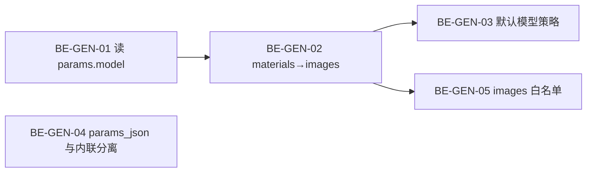

# 16 — 统一生成后端已知问题与修复清单

> **用途**：记录联调「素材库 / 高级生成台 / 口播向导」时暴露的**服务端缺陷**，供后端同学按优先级修复。  
> **关联文档**：[统一生成 API 文档](../API/统一生成API文档.md)、[15-客户端业务逻辑与服务端功能对照手册](./15-客户端业务逻辑与服务端功能对照手册.md)、[09-获客智能体统一生成架构方案](./09-获客智能体统一生成架构方案.md)  
> **记录日期**：2026-08-26  
> **前端状态**：`web/` 已按本文「前端已做」列完成参数透传；**修复下列后端项前，部分场景仍会失败**。

---

## 总览

| ID | 优先级 | 问题 | 典型现象 | 前端已做 |
|----|--------|------|----------|----------|
| BE-GEN-01 | **P0** | `Submit` 不读取 `params.model` | UI 选 `viduq2`，报错 `viduq1 参考生图需 1-7 张图片` | ✅ `params.model` 已传 |
| BE-GEN-02 | **P0** | 文生图未把 `materials` 合并进 `images` | 选了参考图仍 400 / 校验失败 | ✅ `materials` + `params.images` 双通道 |
| BE-GEN-03 | **P1** | 默认模型按字母序取第一个 | 无 `model` 时落到 `viduq1` 而非 `viduq2` | —（依赖 BE 默认策略） |
| BE-GEN-04 | **P0** | `params_json` 写入 base64 超长 | `Error 1406: Data too long for column 'params_json'` | —（纯后端） |
| BE-GEN-05 | **P2** | `params.images` 不在高级参数白名单 | 前端传的 `images` URL 被 `mergeAdvancedParams` 丢弃 | ✅ 已传，等 BE 放行 |
| BE-GEN-06 | **P2** | 统一提交不走 `translateRefs` | 仅 `materials` 时部分端点参数映射不完整 | 部分场景用 compat 路径 |

---

## BE-GEN-01：`Submit` 忽略客户端指定的模型

### 现象

- 素材库「生成图片」：界面选 **viduq2**（支持 0 张参考图纯文生图），提交后 HTTP 400。
- 错误信息：`viduq1 参考生图需 1-7 张图片`（说明校验用的是 **viduq1** 能力，而非 UI 所选模型）。

### 根因

1. 统一提交 `UnifiedSubmit` 调用 `Submit` 时**写死** `Model: ""`：

```1213:1222:internal/usecase/generation/generation.go
	return uc.Submit(ctx, SubmitInput{
		TenantID: in.TenantID,
		BrandID:  in.BrandID,
		SubType:  selectResult.SubType,
		Model:    "", // 空=自动选择
		Params:   selectResult.Params,
		Watermark: in.Watermark,
		OffPeak:   in.OffPeak,
	})
```

2. `Submit` 在 `in.Model == ""` 时走 `getDefaultModel()`，**不读** `params["model"]`（白名单虽含 `model`，但只合并进 params，不参与选模）：

```368:377:internal/usecase/generation/generation.go
	model := in.Model
	if model == "" {
		if sel, ok := adapter.(port.ModelAutoSelector); ok {
			model = uc.pickModelFor(ctx, in.SubType, sel, in.Params)
		}
		if model == "" {
			model = uc.getDefaultModel(ctx, in.SubType)
		}
	}
```

3. `text2image` 适配器**未实现** `ModelAutoSelector`，必然落到 `getDefaultModel`。

### 前端已做

- 素材库文生图：`submitGenerationTaskCompat` + `params.model` / 顶层 `model`。
- 视频 / 配音 / 封面：`submitUnified({ params: { model } })`。
- 高级生成台：`mapLegacyToUnified` 透传顶层 `model` → `params.model`。

### 建议修复

在 `Submit` 选模逻辑中，**优先**使用（按顺序）：

1. `in.Model`（非空）
2. `in.Params["model"]`（string，非空）
3. `ModelAutoSelector.PickModel`
4. `getDefaultModel` / 管理后台默认模型配置

同时 `UnifiedSubmit` 可将 `in.Params["model"]` 提升到 `SubmitInput.Model`，避免歧义。

### 验收

```bash
curl -X POST .../api/v1/generation/submit \
  -d '{"brand_id":"...","text":"测试","type":"image","params":{"model":"viduq2"}}'
```

- 响应 `data.model` 应为 `viduq2`
- 0 张参考图时不应再报 viduq1 校验错误

---

## BE-GEN-02：文生图路径丢弃 `materials` 参考图

### 现象

- 用户选 1–7 张参考图 + 描述，提交文生图仍失败或等价于「无图」请求。

### 根因

`type=image` 时，`selectByType` 只调用 `buildText2ImageParams`，**未使用** `stats`（素材统计）：

```229:232:internal/usecase/generation/endpoint_selector.go
	case "image":
		params := s.buildText2ImageParams(req)
		params["__sub_type"] = "text2image"
		return "text2image", params, nil
```

```246:250:internal/usecase/generation/endpoint_selector.go
func (s *EndpointSelectorImpl) buildText2ImageParams(req entity.UnifiedGenerationRequest) entity.GenerationParams {
	return entity.GenerationParams{
		"prompt": req.Text,
	}
}
```

对比 `img2video` 等同端点，会从 `stats.Images` 写入 `images` 数组；文生图路径缺失该步骤。

Vidu 侧要求（见 `Docs/第三方/Vidu/创建图像任务/图片生成.md`）：

| 模型 | images |
|------|--------|
| viduq2 | 0–7 张（0 = 纯文生图） |
| viduq1 | **1–7 张（必填）** |

### 前端已做

- `materials` 传素材库 ID。
- compat 路径额外在 `params.images` 写入参考图 URL（见 BE-GEN-05）。

### 建议修复

在 `buildText2ImageParams` 或 `selectByType` 的 `image` 分支：

```go
if len(stats.Images) > 0 {
    urls := make([]string, 0, len(stats.Images))
    for _, img := range stats.Images {
        urls = append(urls, img.SourceURL)
    }
    params["images"] = urls
}
```

若 `params.images` 已由高级参数传入，应与 `materials` 解析结果合并去重。

### 验收

- `type=image` + `materials=[图ID]` + `model=viduq1` → 校验通过并进入队列。
- `model=viduq2` + 无 materials → 纯文生图成功。

---

## BE-GEN-03：默认模型策略不合理（字母序 viduq1 优先）

### 现象

未显式指定 `model` 时，文生图/文生视频默认落到 **viduq1**，而产品期望傻瓜式路径默认 **viduq2**（支持纯文生图、能力更全）。

### 根因

```228:240:internal/usecase/generation/generation.go
func (uc *GenerationUseCase) getDefaultModel(ctx context.Context, subType string) string {
	names, err := uc.registry.Models(ctx, subType)
	// ...
	return names[0]  // Models() 内部 sort.Strings
}
```

`registry.Models` 对模型名 **字母排序**，`text2image` 出厂能力顺序为 `viduq2`、`viduq1`，排序后 **`viduq1` 在前**。

### 建议修复（择一或组合）

1. **DB 默认模型**：`generation_specs.is_default`，`getDefaultModel` 优先读默认行。
2. **端点级策略**：`text2image` 无图时默认 `viduq2`；有图且仅 viduq1 场景再选 viduq1。
3. **排序规则**：默认模型置顶，而非纯字母序。

### 验收

- 不传 `model`、不传 `materials` 的文生图请求 → `data.model == viduq2`（或后台配置的默认项）。

---

## BE-GEN-04：`params_json` 落库前内联 base64 导致超长

### 现象

```
任务保存失败: Error 1406 (22001): Data too long for column 'params_json'
```

常见于：对口型、数字人、图生视频等携带**本地视频/大图**的开发环境联调。

### 根因

1. `Submit` 在落库前对 `in.Params` 执行 `localizePrivateMaterials`，将 `localhost` / 内网 `/media/` URL **替换为 base64 data URI**。
2. 随后 **整份 params** JSON 序列化写入 `generation_tasks.params_json`。
3. 迁移 `039_generation_fix.sql` 将列定为 **`TEXT`**（约 64KB），大图/视频极易超限。

```343:347:internal/usecase/generation/generation.go
	if in.Params != nil {
		if err := uc.localizePrivateMaterials(ctx, in.Params); err != nil {
			return entity.GenerationTask{}, err
		}
	}
```

内联逻辑本意是发给 Vidu 的请求体可访问；**不应**把内联结果持久化到 `params_json`。

### 建议修复（推荐方案 A）

| 方案 | 做法 |
|------|------|
| **A（推荐）** | 落库用**原始 URL** 的 params 副本；仅在 `BuildRequest` 出口对请求 body 做内联 |
| B | `params_json` 扩为 `MEDIUMTEXT` / `LONGTEXT`（治标，大视频仍可能爆） |
| C | 大文件禁止内联，强制 `PUBLIC_BASE_URL` 公网可达 |

### 验收

- 本地 5–10MB 视频走 `lip_sync` / `digital_human` → 任务能创建，`params_json` 仍为 URL 字符串、无巨型 base64。

---

## BE-GEN-05：`params.images` 未纳入高级参数白名单

### 现象

前端 compat 路径为文生图额外传 `params.images: ["https://..."]`，服务端 `mergeAdvancedParams` **静默丢弃**。

### 根因

```341:349:internal/usecase/generation/endpoint_selector.go
var advancedParamKeys = map[string]bool{
	// ...
	"model": true, "resolution": true, "duration": true, "aspect_ratio": true,
}
```

`images` **不在**白名单；`advancedParamAllowed("images")` 为 false。

### 建议修复

- 将 `"images": true` 加入 `advancedParamKeys`（或与 BE-GEN-02 合并：统一从 materials 构建，不依赖客户端传 images）。

### 验收

- 统一 submit 请求体含 `params.images` 时，合并后 `adapter.Validate` 能收到非空 `images`。

---

## BE-GEN-06：统一提交路径缺少 `Refs` / `translateRefs`

### 现象

高级生成台经 `POST /generation/submit` 提交时，`@引用` 仅转为 `materials` ID，**不经过** `translateRefs`（该函数仅在带 `SubmitInput.Refs` 的旧 `Submit` 路径使用）。

### 根因

- `UnifiedSubmit` → `Submit` 时 `Refs` 为空。
- 对 `text2image` 等端点，仅靠 `materials` 不足以生成完整 params（见 BE-GEN-02）。
- 对 `lip_sync` / `digital_human`，若未来仅靠 materials 推断，需保证 selector 与 translator 行为一致。

### 建议修复

1. **短期**：修复 BE-GEN-02，materials → images 在 selector 层统一处理。
2. **中期**：`UnifiedSubmitInput` 增加 `refs` 字段，或在 selector 出口对 params 调用与 `translateRefs` 等价的映射。

---

## 其他关联项（非本次阻塞，可排期）

| 项 | 说明 |
|----|------|
| 主体 `server_id` 一致性 | 口播管线部分路径仍用 image+audio → `digital_human` 回退，未始终走 subject `server_id` |
| TTS 音色试听 | 需短文本试听接口或预生成样本 URL |
| 管理后台默认模型 | `generation_specs.is_default` 与 `getDefaultModel` 应对齐（计划文档已提及） |
| 失败 `retry_hint` | 后端已下发；前端已消费（见 doc 15） |

---

## 推荐修复顺序



1. **BE-GEN-01 + BE-GEN-02**：解锁素材库 / 封面「纯文生图」与「带参考图」主路径。  
2. **BE-GEN-04**：解锁本地口播 / 数字人联调。  
3. **BE-GEN-03 / 05 / 06**：体验与架构一致性加固。

---

## 联调检查表（后端自测）

- [ ] `type=image` + `params.model=viduq2` + 仅 text → 200/queueing，`model` 字段为 viduq2  
- [ ] `type=image` + `materials=[1张图]` + `model=viduq1` → 校验通过  
- [ ] `type=video` + `params.model=viduq2` + text → 使用指定模型  
- [ ] `lip_sync` + 本地 8MB 视频 → 任务创建成功，无 1406  
- [ ] `params_json` 长度 < 10KB（典型 URL 参数）  
- [ ] 不传 model 的文生图 → 默认 viduq2（或后台配置项）

---

## 变更记录

| 日期 | 说明 |
|------|------|
| 2026-08-26 | 初版：素材库 400、params_json 1406、模型透传联调结论 |
